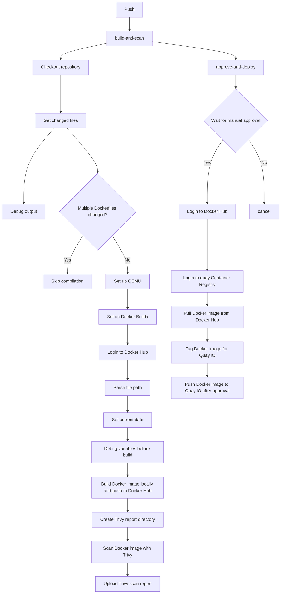

# workflow

```mermaid
graph TD
    A[Push] --> B[build-and-scan]
    B --> C[Checkout repository]
    C --> D[Get changed files]
    D --> E[Debug output]
    D --> F{Multiple Dockerfiles changed?}
    F -- Yes --> G[Skip compilation]
    F -- No --> H[Set up QEMU]
    H --> I[Set up Docker Buildx]
    I --> J[Login to Docker Hub]
    J --> K[Parse file path]
    K --> L[Set current date]
    L --> M[Debug variables before build]
    M --> N[Build Docker image locally and push to Docker Hub]
    N --> O[Create Trivy report directory]
    O --> P[Scan Docker image with Trivy]
    P --> Q[Upload Trivy scan report]

    B --> R[approve-and-deploy]
    R --> S{Wait for manual approval}
    S -- Yes --> T[Login to Docker Hub]
    S -- No --> T1[cancel]
    T --> U[Login to quay Container Registry]
    U --> V[Pull Docker image from Docker Hub]
    V --> W[Tag Docker image for Quay.IO]
    W --> X[Push Docker image to Quay.IO after approval]
```
  